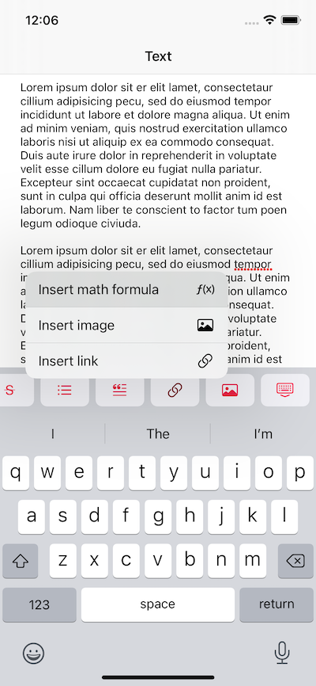

# AccessoryKit

A customizable, expandable, and easy-to-use input accessory view component for iOS.

[](https://cocoapods.org/pods/AccessoryKit)
[](https://cocoapods.org/pods/AccessoryKit)
[](https://cocoapods.org/pods/AccessoryKit)

## Features

**AccessoryKit** aims to provide a customizable, expandable and easy-to-use input accessory view. This component is developed for and is currently used in my app [MDNotes](https://apps.apple.com/us/app/mdnotes/id1471287219).



The main features are:

* Scrollable input accessory view with blurry background and customizable buttons.
* Supports Auto Layout and Safe Area.
* Supports dark mode.
* Provides built-in pre-defined buttons with SF Symbol.
* Supports presenting `UIMenu` on input accessory view.

## Usage

### Requirements

* iOS 13.0+
* Swift 5.3+

### Installation

To install AccessoryKit, simply add the following line to your Podfile:

```ruby
pod 'AccessoryKit'
```

### Example

To run the example project, clone the repo, and run `pod install` from the Example directory first.

### API

```swift
// Create view model array of key buttons
let keyButtons: [KeyboardAccessoryButton] = [
    // Create button with built-in type and tap handler block
    KeyboardAccessoryButton(type: .undo, tapHandler: { [weak self] in
        self?.undo()
    }),
    // Create button with UIImage
    KeyboardAccessoryButton(image: UIImage(named: "img"), tapHandler: {}),
    // Create button with UIMenu
    KeyboardAccessoryButton(type: .link, menu: createInsertMenu()),
]

// Initialize `KeyboardAccessoryView`
let accessoryView = KeyboardAccessoryView(
    frame: CGRect(x: 0, y: 0, width: view.frame.width, height: 0),
    keyButtons: keyButtons,
    showDismissKeyboardKey: true,
    delegate: self)

// Assign the accessory view instance to `UITextView`
textView.inputAccessoryView = accessoryView

// Set tint color for the whole view
accessoryView.tintColor = .systemPink
// ...or at a given index
accessoryView.setTintColor(.systemGreen, at: 5)

// Set enabled at a given index
accessoryView.setEnabled(false, at: 1)
```

## TODO

- [ ] Expose more APIs for customization
- [x] Tint color
- [ ] Tweak UI
- [x] Use SF Symbol
- [x] UIMenu support
- [ ] UIAction support
- [x] SPM support

## License

AccessoryKit is available under the MIT license. See the [LICENSE](LICENSE) file for more info.
